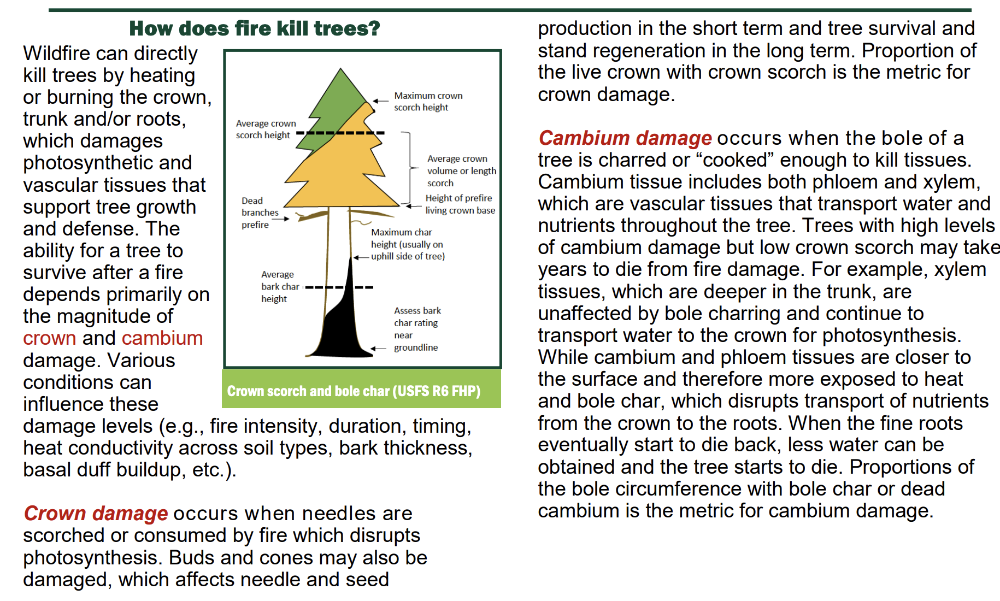

```{r setup, include=FALSE}
knitr::opts_chunk$set(echo = TRUE)
library(tidyverse)
library(skimr)
library(tidymodels)
library(caret)
library(vip)

```

## Lab 4: Fire and Tree Mortality

The database we'll be working with today includes 36066 observations of individual trees involved in prescribed fires and wildfires occurring over 35 years, from 1981 to 2016. It is a subset of a larger fire and tree mortality database from the US Forest Service (see data description for the full database here: [link](https://www.nature.com/articles/s41597-020-0522-7#Sec10)). Our goal today is to predict the likelihood of tree mortality after a fire.

### Data Exploration

Outcome variable: *yr1status* = tree status (0 = alive, 1 = dead) assessed one year post-fire.

Predictors: *YrFireName, Species, Genus_species, DBH_cm, CVS_percent, BCHM_m, BTL* (Information on these variables available in the database metadata ([link](https://www.fs.usda.gov/rds/archive/products/RDS-2020-0001-2/_metadata_RDS-2020-0001-2.html))).

```{r}

trees_dat <- read_csv(file = "https://raw.githubusercontent.com/MaRo406/eds-232-machine-learning/main/data/trees-dat.csv") |> 
  mutate_if(is.ordered, factor, ordered = FALSE)

```

> Question 1: Recode all the predictors to a zero_based integer form

### Data Splitting

```{r}

trees <- trees_dat |> 
  recipe(yr1status ~ .) |> 
  step_integer(YrFireName, Species, Genus_species, zero_based = TRUE) |> 
  prep() |> 
  bake(new_data = NULL)

```

> Question 2: Create trees_training (70%) and trees_test (30%) splits for the modeling

```{r}

# Create a splitted data frame
trees_split <- trees |> 
  initial_split(prop = 0.7, strata = "yr1status")

tree_train <- training(trees_split)
tree_test <- testing(trees_split)

```

> Question 3: How many observations are we using for training with this split? *Response: For the training set we are using 25,246 observations. ´r dim(tree_train)[1]´*

### Simple Logistic Regression

Let's start our modeling effort with some simple models: one predictor and one outcome each.

> Question 4: Choose the three predictors that most highly correlate with our outcome variable for further investigation.

```{r}

vip(tree_train, num_features = 3, method = "model")

```

```{r }
# Load the corrplot package
library(corrplot)

# Obtain correlation matrix
tree_matrix <- cor(trees)

# Make a correlation plot between the variables
corrplot(tree_matrix, 
         method = "shade", 
         shade.col = NA, 
         tl.col = "black", 
         tl.srt = 45, 
         addCoef.col = "black", 
         cl.pos = "n", 
         order = "original")

```

> Question 5: Use glm() to fit three simple logistic regression models, one for each of the predictors you identified.

```{r}

model1 <- glm(yr1status ~ CVS_percent,
              family = binomial,
              data= tree_train)

model2 <- glm(yr1status ~ BCHM_m,
              data = tree_train,
              family = binomial)

model3 <- glm(yr1status ~ DBH_cm,
              data = tree_train,
              family = binomial)

```

> Question 6: That said, take a stab at interpreting our model coefficients now.

### Interpret the Coefficients

We aren't always interested in or able to interpret the model coefficients in a machine learning task. Often predictive accuracy is all we care about.

```{r}
tidy(model1)

exp(coef(model1))
exp(coef(model2))
exp(coef(model3))

```

*Response: Predicting results*

Model 1: For the odds of a tree to be alive after 1 year of the fire ( yr1status = 1), the CVS_percent (Crown Volume Scratch) affects by 1.0798 for every percents that it increases.

Model 2: For the odds of a tree to be alive after 1 year of the fire ( yr1status = 1), the BCHM_m (maximum Bark Char vertical Height from ground on a tree bole in meters) affects with 1.2392 for every meter of bark char.

Model 3: For the odds of a tree to be alive after 1 year of the fire ( yr1status = 1), the DBH (Diameter of Breast Height), has an effect of 0.942 for every increase in cm.

**Variables full names:** 

1. CVS_percent: Percent of the pre-fire crown volume that was scorched or consumed by fire (values 0 to 100). If measured, this is the CVS from field measurements. Otherwise it is the calculated CVS from crown length measurement,

2.  BCHM_m: Maximum bark char (also called bole char, bole scorch in other publications) vertical height from ground on a tree bole, rounded to nearest 0.01 m

3.  DBH_cm: Diameter at breast height rounded to nearest 0.1 cm

Here is a quick photo explaining the effects of some variables in tree fires.

[](https://www.oregon.gov/odf/Documents/forestbenefits/post-fire-tree-mortality.pdf)

> Question 7: Now let's visualize the results from these models. Plot the fit to the training data of each model.


Plotting the results:
```{r}
#Model 1
ggplot(tree_train, aes(x = CVS_percent, y = yr1status)) +
  geom_point() +
  labs(title = "Model 1",
       subtitle = "Crown Volume Scratch") +
 stat_smooth(method = "glm",  
                  se = TRUE,
                  method.args = list(family = "binomial"))

```

```{r}
#Model 2
ggplot(tree_train, aes(x = BCHM_m, y = yr1status)) +
  geom_point() +
  labs(title = "Model 2",
       subtitle = "Bark Char Vertical Height (m)") +
 stat_smooth(method = "glm",  
                  se = TRUE,
                  method.args = list(family = "binomial"))

```

```{r}
#Model 1
ggplot(tree_train, aes(x = DBH_cm, y = yr1status)) +
  geom_point() +
  labs(title = "Model 3",
       subtitle = "Diameter at Breast Height (cm)") +
 stat_smooth(method = "glm",  
                  se = TRUE,
                  method.args = list(family = "binomial"))

```


### Multiple Logistic Regression

Let's not limit ourselves to a single-predictor model. More predictors might lead to better model performance.

> Question 8: Use glm() to fit a multiple logistic regression called "logistic_full", with all three of the predictors included. Which of these are significant in the resulting model?

```{r}
#Estimating the coeefcicients with a Multiple Logistic Regression

logistic_full <- glm(yr1status ~ CVS_percent + BCHM_m + DBH_cm,
                   data = tree_train,
                   family = binomial)

```

*Response: The most significant predictor is the Bark Char Height with 0.15878*


### Estimate Model Accuracy

Now we want to estimate our model's generalizability using resampling.

> Question 9: Use cross validation to assess model accuracy. Use caret::train() to fit four 10-fold cross-validated models (cv_model1, cv_model2, cv_model3, cv_model4) that correspond to each of the four models we've fit so far: three simple logistic regression models corresponding to each of the three key predictors (CVS_percent, DBH_cm, BCHM_m) and a multiple logistic regression model that combines all three predictors.

Model 1: Crown Volume Scratch in percental
```{r}
# First 10-fold cross-validation
# Model 1

set.seed(123)
cv_model1 <- train(yr1status ~ CVS_percent,
                   data = tree_train,
                   method = "glm",
                   family = "binomial",
                   trControl = trainControl(method = "cv", 
                                            number = 10))

```


Model 2: Bark Char Volume Height in Meters
```{r}
# Second 10-fold cross-validation
# Model 2

set.seed(123)
cv_model2 <- train(yr1status ~ BCHM_m,
                   data = tree_train,
                   method = "glm",
                   family = "binomial",
                   trControl = trainControl(method = "cv", 
                                            number = 10))

```


Model 3: DBH_cm (Diameter at Breast Height in cm)
```{r}
# Third 10-fold cross-validation
# Model 3

set.seed(123)
cv_model3 <- train(yr1status ~ DBH_cm,
                   data = tree_train,
                   method = "glm",
                   family = "binomial",
                   trControl = trainControl(method = "cv", 
                                            number = 10))

```


Model 4: Calculating the model with all 3 predicted variables
```{r}
# Fourth 10-fold cross-validation
# Model 4

set.seed(123)
cv_model4 <- train(yr1status ~ CVS_percent + BCHM_m + DBH_cm,
                   data = tree_train,
                   method = "glm",
                   family = "binomial",
                   trControl = trainControl(method = "cv", 
                                            number = 10))

```


> Question 10: Use caret::resamples() to extract then compare the classification accuracy for each model. (Hint: resamples() wont give you what you need unless you convert the outcome variable to factor form). Which model has the highest accuracy?


```{r}

summary(
  resamples(
    list(
      model1 = cv_model1, 
      model2 = cv_model2, 
      model3 = cv_model3,
      model4 = cv_model4
    )
  )
)$statistics$Accuracy


```


Let's move forward with this single most accurate model.

> Question 11: Compute the confusion matrix and overall fraction of correct predictions by the model.
>
> Question 12: Explain what the confusion matrix is telling you about the types of mistakes made by logistic regression.
>
> Question 13: What is the overall accuracy of the model? How is this calculated?

### Test Final Model

Alright, now we'll take our most accurate model and make predictions on some unseen data (the test data).

> Question 14: Now that we have identified our best model, evaluate it by running a prediction on the test data, trees_test.
>
> Question 15: How does the accuracy of this final model on the test data compare to its cross validation accuracy? Do you find this to be surprising? Why or why not?
