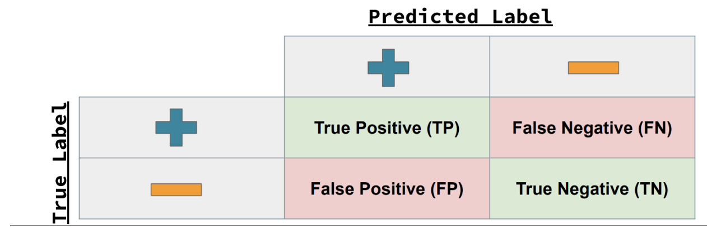

```{r setup, include=FALSE}
knitr::opts_chunk$set(echo = TRUE)
library(tidyverse)
library(skimr)
library(tidymodels)
library(caret)
library(vip)
library(knitr)
library(xtable)
library(kableExtra)

```

## Lab 4: Fire and Tree Mortality

The database we'll be working with today includes 36066 observations of individual trees involved in prescribed fires and wildfires occurring over 35 years, from 1981 to 2016. It is a subset of a larger fire and tree mortality database from the US Forest Service (see data description for the full database here: [link](https://www.nature.com/articles/s41597-020-0522-7#Sec10)). Our goal today is to predict the likelihood of tree mortality after a fire.

### Data Exploration

Outcome variable: *yr1status* = tree status (0 = alive, 1 = dead) assessed one year post-fire.

Predictors: *YrFireName, Species, Genus_species, DBH_cm, CVS_percent, BCHM_m, BTL* (Information on these variables available in the database metadata ([link](https://www.fs.usda.gov/rds/archive/products/RDS-2020-0001-2/_metadata_RDS-2020-0001-2.html))).

```{r}

trees_dat <- read_csv(file = "https://raw.githubusercontent.com/MaRo406/eds-232-machine-learning/main/data/trees-dat.csv") |> mutate_if(is.ordered, factor, ordered = FALSE)

```

> Question 1: Recode all the predictors to a zero_based integer form

### Data Splitting

```{r}

trees <- trees_dat |> 
  recipe(yr1status ~ .) |> 
  step_integer(YrFireName, Species, Genus_species, zero_based = TRUE) |> 
  prep() |> 
  bake(new_data = NULL)

```

> Question 2: Create trees_training (70%) and trees_test (30%) splits for the modeling

```{r}
# Create a splitted data frame
trees_split <- trees |> 
  initial_split(prop = 0.7, strata = "yr1status")

tree_train <- training(trees_split)
tree_test <- testing(trees_split)

```

> Question 3: How many observations are we using for training with this split? *Response: For the training set we are using `r dim(tree_train)[1]` observations.*

```{r}
dim(tree_train)[1]
```

### Simple Logistic Regression

Let's start our modeling effort with some simple models: one predictor and one outcome each.

> Question 4: Choose the three predictors that most highly correlate with our outcome variable for further investigation.

```{r, fig.align = 'center', out.width = "80%"}
# Load the corrplot package
library(corrplot)

# Obtain correlation matrix
tree_matrix <- cor(trees)

# Make a correlation plot between the variables
corrplot(tree_matrix, 
         method = "shade", 
         shade.col = NA, 
         tl.col = "black", 
         tl.srt = 45, 
         addCoef.col = "black", 
         cl.pos = "n", 
         order = "original")

```

*Response: The three variables that have the highest correlation with our target variable (yr1status) are: CVS_Percent, BCHM_m, and DBH_cm. We will use this 3 variables as our predictors for the model. It is important to take into consideration the symbols as positive correlations will affect our target variable towards death (CVS, BCHM) and the negative correlation towards life (DBH).*

**Variables full names:**

1.  CVS_percent: Percent of the pre-fire crown volume that was scorched or consumed by fire (values 0 to 100). If measured, this is the CVS from field measurements. Otherwise it is the calculated CVS from crown length measurement.

2.  BCHM_m: Maximum bark char (also called bole char, bole scorch in other publications) vertical height from ground on a tree bole, rounded to nearest 0.01 m.

3.  DBH_cm: Diameter at breast height rounded to nearest 0.1 cm.

> Question 5: Use glm() to fit three simple logistic regression models, one for each of the predictors you identified.

```{r}

model1_cvs <- glm(yr1status ~ CVS_percent,
              family = binomial,
              data= tree_train)

model2_bchm <- glm(yr1status ~ BCHM_m,
              data = tree_train,
              family = binomial)

model3_dbh <- glm(yr1status ~ DBH_cm,
              data = tree_train,
              family = binomial)

```

Question 6: That said, take a stab at interpreting our model coefficients now.

### Interpret the Coefficients

We aren't always interested in or able to interpret the model coefficients in a machine learning task. Often predictive accuracy is all we care about.

```{r}
#Exponentiate the coefficients because they are log-transformed 

exp(coef(model1_cvs))
exp(coef(model2_bchm))
exp(coef(model3_dbh))

```

*Response: Predicting results*

Model 1: The odds of a tree to be dead after 1 year of the fire ( yr1status = 1), increases multiplicatively by `r round(exp(coef(model1_cvs))[2],3)` for each unit of `CVS_percent` (Crown Volume Scratch)

Model 2: The odds of a tree to be dead after 1 year of the fire ( yr1status = 1), increases multiplicativly by `r round(exp(coef(model2_bchm))[2],3)` for each unit of `BCHM_m` (maximum Bark Char vertical Height from ground on a tree bole in meters).

Model 3: The odds of a tree to be dead after 1 year of the fire ( yr1status = 1), increases multiplicativly by `r round(exp(coef(model3_dbh))[2],3)` for each unit of `DBH` (Diameter of Breast Height).

Just for context and understanding of the variables, here is a quick photo explaining the effects of some variables in tree fires.

[{width="90%"}](https://www.oregon.gov/odf/Documents/forestbenefits/post-fire-tree-mortality.pdf)

*Image: How does fire kill trees? Oregon Department of Forestry (2020) Forest health fact sheet, Post-fire tree mortality. Available at: <https://www.oregon.gov/odf/Documents/forestbenefits/post-fire-tree-mortality.pdf> (Accessed: February 8, 2023).*

Question 7: Now let's visualize the results from these models. Plot the fit to the training data of each model.

Plotting the results:

```{r}
#Model 1
ggplot(tree_train, aes(x = CVS_percent, y = yr1status)) +
  geom_point() +
  labs(title = "Logistic Model 1",
       subtitle = "Crown Volume Scratch",
       y = "Probability of Tree Death",
       x = "Crown Volume Scorched (%)",
       caption = "Y Axis:\n Tree Death = 1\n Tree Alive = 0") +
 stat_smooth(method = "glm",  
                  se = TRUE,
                  method.args = list(family = "binomial"))
```

```{r}
#Model 2
ggplot(tree_train, aes(x = BCHM_m, y = yr1status)) +
  geom_point() +
  labs(title = "Logistic Model 2",
       subtitle = "Bark Char Vertical Height (m)", 
       y = "Probability of Tree Death",
       x = "BCHM (m)",
       caption = "Y Axis:\n Tree Death = 1\n Tree Alive = 0") +
 stat_smooth(method = "glm",  
                  se = TRUE,
                  method.args = list(family = "binomial"))

```

```{r}
#Model 3
ggplot(tree_train, aes(x = DBH_cm, y = yr1status)) +
  geom_point() +
  labs(title = "Logistic Model 3",
       subtitle = "Diameter at Breast Height (cm)",
       y = "Probability of Tree Death",
       x = "Diameter at Breast Height (cm)",
       caption = "Y Axis:\n Tree Death = 1\n Tree Alive = 0") +
 stat_smooth(method = "glm",  
                  se = TRUE,
                  method.args = list(family = "binomial"))

```

### Multiple Logistic Regression

Let's not limit ourselves to a single-predictor model. More predictors might lead to better model performance.

Question 8: Use glm() to fit a multiple logistic regression called "logistic_full", with all three of the predictors included. Which of these are significant in the resulting model?

```{r}
#Estimating the coefficients with a Multiple Logistic Regression

logistic_full <- glm(yr1status ~ CVS_percent + BCHM_m + DBH_cm,
                   data = tree_train,
                   family = binomial)


```

*Response: In this case, the highest coefficient is now for the Bark Char Height with `r tidy(logistic_full)[3,2]`, but according to the p-value as they are all lower than 0.05 they are statistically significant.*

### Estimate Model Accuracy

Now we want to estimate our model's generalizability using resampling.

> Question 9: Use cross validation to assess model accuracy. Use caret::train() to fit four 10-fold cross-validated models (cv_model1, cv_model2, cv_model3, cv_model4) that correspond to each of the four models we've fit so far: three simple logistic regression models corresponding to each of the three key predictors (CVS_percent, DBH_cm, BCHM_m) and a multiple logistic regression model that combines all three predictors.

Check the class of my columns and factorize if needed

```{r}
#Just informative
#skim(tree_train)
#levels(as.factor(tree_train$yr1status))

```

Model 1: Crown Volume Scratch in percentage

```{r}
# First 10-fold cross-validation
# Model 1
set.seed(123)

cv_model1_cvs <- train(as.factor(yr1status) ~ CVS_percent,
                   data = tree_train,
                   method = "glm",
                   family = "binomial",
                   trControl = trainControl(method = "cv", 
                                            number = 10))

```

Model 2: Bark Char Volume Height in Meters

```{r}
# Second 10-fold cross-validation
# Model 2
set.seed(123)

cv_model2_bchm <- train(as.factor(yr1status) ~ BCHM_m,
                   data = tree_train,
                   method = "glm",
                   family = "binomial",
                   trControl = trainControl(method = "cv", 
                                            number = 10))

```

Model 3: DBH_cm (Diameter at Breast Height in cm)

```{r}
# Third 10-fold cross-validation
# Model 3
set.seed(123)

cv_model3_dbh <- train(as.factor(yr1status) ~ DBH_cm,
                   data = tree_train,
                   method = "glm",
                   family = "binomial",
                   trControl = trainControl(method = "cv", 
                                            number = 10))

```

Model 4: Calculating the model with all 3 predicted variables

```{r}
# Fourth 10-fold cross-validation
# Model 4
set.seed(123)

cv_model4_all <- train(as.factor(yr1status) ~ CVS_percent + BCHM_m + DBH_cm,
                   data = tree_train,
                   method = "glm",
                   family = "binomial",
                   trControl = trainControl(method = "cv", 
                                            number = 10))
```

> Question 10: Use caret::resamples() to extract then compare the classification accuracy for each model. (Hint: resamples() wont give you what you need unless you convert the outcome variable to factor form). Which model has the highest accuracy?

```{r}
#Create a matrix that has a summary of the models

models_accuracy <- summary(
  resamples(
    list(
      mod1 = cv_model1_cvs, 
      mod2 = cv_model2_bchm, 
      mod3 = cv_model3_dbh,
      mod4 = cv_model4_all
    )
  )
)$statistics$Accuracy
```

Printing the model Accuracy

```{r}

kable(models_accuracy,
      padding = 1,
      digits = round(3),
      align = "c",
      format = "pipe",
      caption = "Models Accurarcy Summary")
  
```

*Response: The highest accuracy model comes from the multiple logistic regression model (model4). It has an accuracy of `r round(max(models_accuracy[,"Mean"]),4)`.*

Let's move forward with this single most accurate model.

> Question 11: Compute the confusion matrix and overall fraction of correct predictions by the model.

```{r}
#Overall predict class

predict_class <- predict(cv_model4_all, tree_train)
train_confusion_matrix <- confusionMatrix(data = predict_class,
                                    reference = as.factor(tree_train$yr1status))


```

> Question 12: Explain what the confusion matrix is telling you about the types of mistakes made by logistic regression.

```{r}
knitr::kable(train_confusion_matrix$table,
             col.names = c("Predicted Alive", "Predicted Dead"),
             padding = 1,
             align = "c",
             format = "pipe",
             caption = "Training Confusion Matrix")
```

*Response: The confusion Matrix is showing a high Accuracy with `r train_confusion_matrix$overall[1]`. (\~ 90% accuracy). Going through the numbers in the matrix we have `r train_confusion_matrix$table[1]`as the True Positive (TP) observations and `r train_confusion_matrix$table[4]` as True Negative (TN). On the other hand, there are `r train_confusion_matrix$table[2]` within the False Positive (FP) observations saying that the observed trees are predicted alive, but their true value is that is dead. Following with `r train_confusion_matrix$table[3]` observations falling within the False Negative (FN) meaning that the predicted value is Dead Tree, but the true value is Alive.*



Question 13: What is the overall accuracy of the model? How is this calculated?

```{r}
#Indexing
train_confusion_matrix$overall["Accuracy"]
```

*Response: The overall accuracy of the model is \~ 90%. There is a formula to calculate the overall accuracy:*

$$Overall \text{ }Accuarcy = \frac{TP\text{ }+ \text{ }  TN} {\sum \text{ }(Total\text{ } Observations)}$$

```{r}
# Manual Calculation
(train_confusion_matrix$table[1] + train_confusion_matrix$table[4]) / dim(tree_train)[1]
```

### Test Final Model

Alright, now we'll take our most accurate model and make predictions on some unseen data (the test data).

> Question 14: Now that we have identified our best model, evaluate it by running a prediction on the test data, trees_test.

```{r}

test_model4_all <- train(as.factor(yr1status) ~ CVS_percent + BCHM_m + DBH_cm,
                   data = tree_test,
                   method = "glm",
                   family = "binomial")

test_prediction <- predict(cv_model4_all, tree_test)

test_confusion_matrix <- confusionMatrix(data = test_prediction,
                 reference = as.factor(tree_test$yr1status))

knitr::kable(test_confusion_matrix$table,
             col.names = c("Predicted Alive", "Predicted Dead"),
             padding = 1,
             align = "c",
             format = "pipe",
             caption = "Test Confusion Matrix")

```

> Question 15: How does the accuracy of this final model on the test data compare to its cross validation accuracy? Do you find this to be surprising? Why or why not?

```{r}

train_confusion_matrix$overall["Accuracy"]
test_confusion_matrix$overall["Accuracy"]

```

*Response: As you can see in the results the Accuracy of the model in the test data is very similar to the training. This will confirm that the stratification data at the beginning of the split was done nicely and qualitatively. In other words, our testing model is very accurate on the true data giving us confidence to try it out in unknown data sets.*

\-\-\-\-\-\-\-\-\-\-\-\-\-\-\-\-\-\-\-\-\-\-\-\-\-\-\-\-\-\-\-\-\-\-\-\-\-\-\-\-\-\-\-\-\-\-\-\-\-\-\-\-\--

EXTRA.....

Book Chapter 5: Logistic Regression

<https://bradleyboehmke.github.io/HOML/logistic-regression.html>

PLS Logistic Regression.- Assess if reducing the dimension of our numeric predictors helps to improve accuracy.

```{r}
#Creating the two pls models (training and testing)

set.seed(123)
cv_model_pls <- train(
  as.factor(yr1status) ~ ., 
  data = tree_train, 
  method = "pls",
  family = "binomial",
  trControl = trainControl(method = "cv", number = 10),
  preProcess = c("zv", "center", "scale"),
  tuneLength = 16)

test_model_pls <- train(
  as.factor(yr1status) ~ ., 
  data = tree_test, 
  method = "pls",
  family = "binomial",
  trControl = trainControl(method = "cv", number = 10),
  preProcess = c("zv", "center", "scale"),
  tuneLength = 16)


```

Graph the results

```{r}

df_test <- data.frame(test_model_pls$results[,1:2]) |> 
  mutate(model_type = "test")
df_cv <- data.frame(cv_model_pls$results[,1:2]) |> 
  mutate(model_type = "cv train")

model_merge <- rbind(df_test, df_cv)

x <- 1:7

ggplot(model_merge, aes(x = ncomp, y = Accuracy, col = model_type)) +
  geom_line() + 
  geom_point() +
  labs(title = "PLS Cross Validation",
       subtitle = "Models Comparison",
       x = "Components",
       y = "Accuracy (Cross-Validation)") +
  scale_x_continuous(labels= as.character(x),breaks=x)

```
